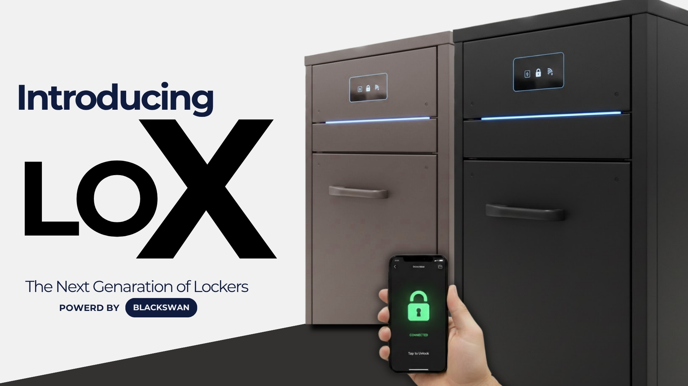
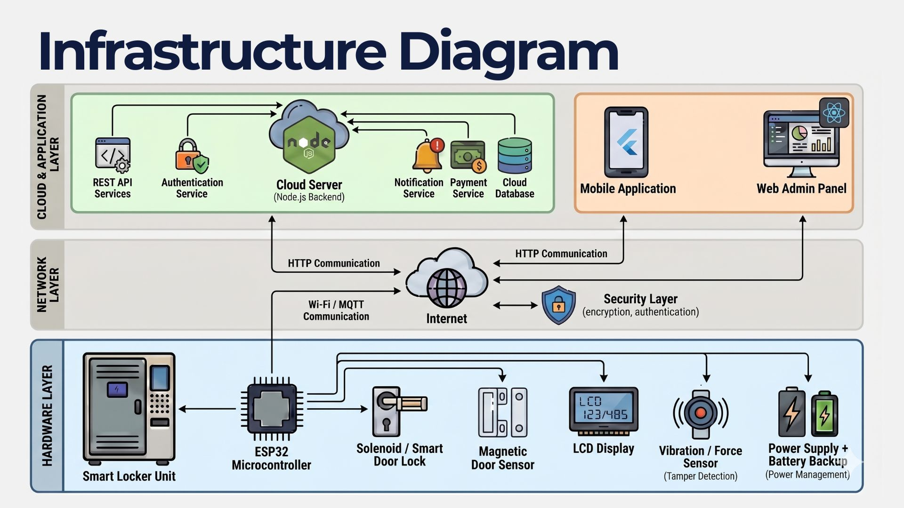
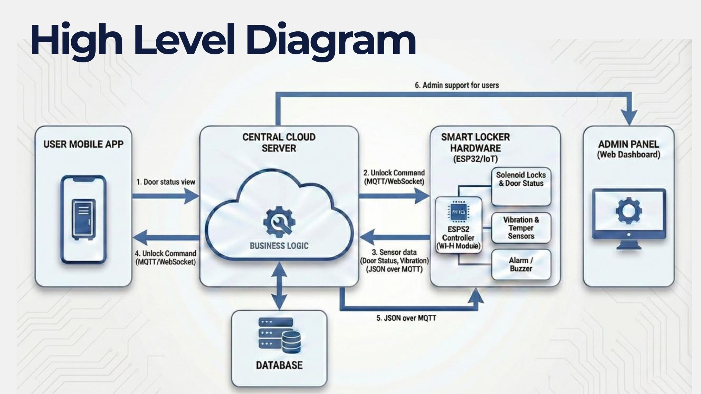
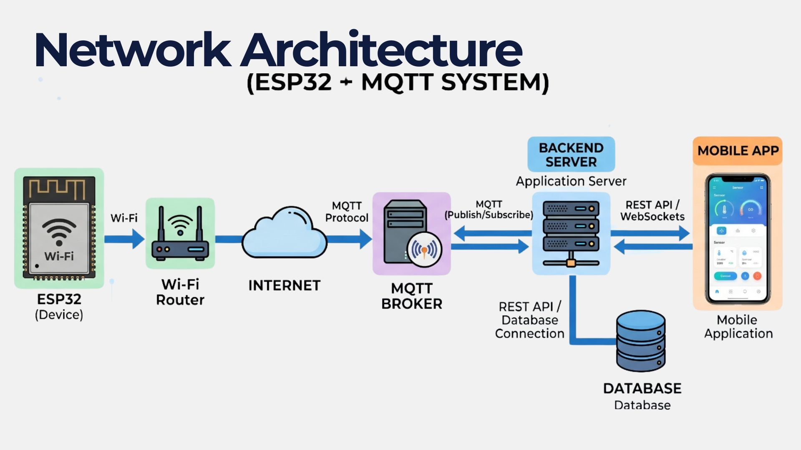
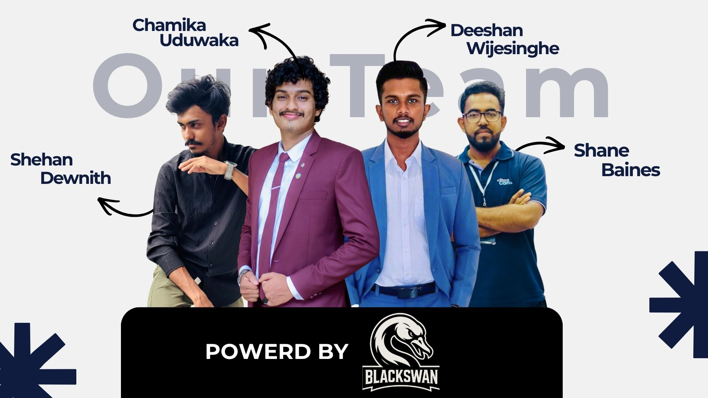

# LOX – Mobile App Based Smart Locker System

> “KEEP SECURE”

---

## Project Overview

LOX smartLocker is a mobile app–based smart locker system that enables users to book, lock, and monitor lockers securely without physical keys. Using ESP32 hardware and cloud connectivity, it provides real-time status updates, door monitoring, and enhanced security, offering a scalable and convenient solution for modern smart storage.



---

## The Problem & Motivation

The rapid infrastructure development in Sri Lanka, including the establishment of **Multimodal Transportation Centers** like Kadawatha and Makumbura, has created a critical gap in traveler convenience. While these hubs centralize transit, they lack integrated, secure facilities for commuters and tourists to store their belongings.

### **1. Public Transit & Tourism Obstacles**
* **Logistical Friction:** Commuters face limited access to essential services like canteens and washrooms because they are forced to carry heavy bags at all times.
* **Tourism Inefficiency:** In a tourism-driven economy, visitors face high costs and restricted mobility, often forced to depend on expensive hotel storage or private drivers just to visit attractions like beaches and temples without their luggage.
* **Security Vulnerabilities:** Carrying bags in crowded transit hubs significantly increases the risk of theft and loss.

### **2. Institutional Security Gaps**
The problem extends beyond transit to **universities and workplaces**, where current "storage" solutions are fundamentally flawed:
* **Lack of Guardianship:** Existing storage areas are often just open shelves with "at your own risk" notices, offering zero protection for high-value items like laptops and mobile phones.
* **The "Accountability Gap":** Without a smart system, there is a massive security issue regarding personal belongings, as institutions explicitly state they will not take responsibility for lost or stolen items.

**LOX** transforms these "risky spaces" into **Keep and Secure** environments by replacing manual oversight with automated, digital accountability.

---

## Target Audience & Strategic Partnership

The **LOX** project is uniquely positioned as a collaborative initiative between the **Department of Computer Engineering, University of Peradeniya** and the **Urban Development Authority (UDA) of Sri Lanka**. Developed as a direct response to a request from the UDA, this project aims to modernize public infrastructure across the island.

### **Key User Groups (App-Enabled)**

Our solution focuses on high-security, identifiable user environments where digital accountability is paramount:
* **Public Transportation Hubs:** Commuters at Bus Stands and Railway stations.
* **Institutional Environments:** Students and staff within Universities and specialized Workplaces.
* **Recreational Facilities:** Secure storage for Gymnasium users.
* **Urban Infrastructure:** Implementation through the Urban Development Authority's smart city initiatives.


---

## Our Solution: Mobile App Based Locker System

The LOX Mobile App Based Locker System is a comprehensive IoT ecosystem that integrates a user-centric mobile interface with an automated hardware controller.

### **Core Components**
* **User Mobile App:** Enables secure registration/login, real-time availability tracking, reservation, and remote locking/unlocking.
* **Intelligent Locker Station:** Features an automated local controller that manages electronic locks, magnetic door status sensors, and tamper-detection alarms.

### **Unique Value Propositions**
* **Advanced Monitoring:** Built-in "Crash Detection" and real-time tamper alert systems.
* **Optimized Efficiency:** Features a "Smart Queue" for high-traffic areas and comprehensive usage analytics for administrators.
* **Modular Infrastructure:** "Plug and Play" scalability with a marketplace store for purchasing additional locker units.

### **Design Philosophy**
| Efficiency | Dependability | Security |
| :--- | :--- | :--- |
| **Cloud-Driven Workflow:** Low-latency MQTT communication ensures rapid app-to-locker response. | **Offline Resilience:** Lockers log data locally during internet outages to ensure uninterrupted service. | **Data Integrity:** All sensitive transactions are fully encrypted with multi-layer breach detection. |
| **Automation:** Lockers release automatically after use, eliminating the need for manual resets. | **Hardware Redundancy:** Dedicated battery backup support for every locker unit. | **Authentication:** Strict user authentication protocols prevent unauthorized access. |

---

## Infrastructure Diagram



---
## High Level Diagram



---
## Network Architecture Diagram 



---
## Technical Specifications

### **Software Stack**
* **Frontend & Admin:** **React JS** for high-performance dashboards with real-time UI updates.
* **Backend:** **Node.js** for scalable, real-time IoT device integration and API services.
* **Mobile App:** **Flutter** providing a cross-platform (iOS/Android) interface with seamless backend sync.
* **Database:** **MongoDB** for secure, reliable cloud storage of locker states and user analytics.
* **Cloud & Versioning:** Deployed on **AWS** for scalable infrastructure ; version control managed via **GitHub**.

### **Hardware Components**
* **Control Center:** **ESP32 Microcontroller** acts as the central brain with built-in Wi-Fi for real-time cloud communication.
* **Access Control:** **Solenoid Door Lock** for electronic locking and **Magnetic Door Sensors** to verify closed status and enhance security.
* **Monitoring Sensors:** **IR Sensors** to detect object presence and **Vibration Sensors** for silent haptic feedback and tamper alerts.
* **User Interface:** **OLED Display** for clear instructions and **LED Indicators** for at-a-glance status (Available/In-Use).
* **Security & Power:** **Buzzer/Alarms** for unauthorized access alerts ; powered by a stable **Power Supply Module** with **Lithium-ion Battery** backup for outages.

---

## Our_Team



- Chamika CN(https://www.thecn.com/CU193)  Email(e21415@eng.pdn.ac.lk)
- Shehan  CN(https://www.thecn.com/EA806)  Email(e21004@eng.pdn.ac.lk)  
- Deeshan CN(http://www.thecn.com/EW804)   Email(e21444@eng.pdn.ac.lk)  
- Shane   CN(https://www.thecn.com/EB1188) Email(e21045@eng.pdn.ac.lk)  

---

## Links

- GitHub Repo: *(https://github.com/cepdnaclk/e21-3yp-LOX)*  
- Project Page: *(https://cepdnaclk.github.io/e21-3yp-LOX/)*  

---

## Note

This repository contains the implementation of the **Mobile App-Based Smart Locker System**, part of the larger **LOX Smart Locker Project**.


<!--
### Enable GitHub Pages

You can put the things to be shown in GitHub pages into the _docs/_ folder. Both html and md file formats are supported. You need to go to settings and enable GitHub pages and select _main_ branch and _docs_ folder from the dropdowns, as shown in the below image.


### Special Configurations

These projects will be automatically added into [https://projects.ce.pdn.ac.lk](). If you like to show more details about your project on this site, you can fill the parameters in the file, _/docs/index.json_


```
{
  "title": "e21-3yp-LOX",
  "team": [
    {
      "name": "Shehan Dewnith",
      "email": "e21005@eng.pdn.ac.lk",
      "eNumber": "E/21/005"
    },
    {
      "name": "Shane Baines",
      "email": "e21045@eng.pdn.ac.lk",
      "eNumber": "E/21/045"
    },
    {
      "name": "Chamika Uduwaka",
      "email": "e21415@eng.pdn.ac.lk",
      "eNumber": "E/21/415"
    },
    {
      "name": "Deeshan Wijesinghe",
      "email": "e21444@eng.pdn.ac.lk",
      "eNumber": "E/21/444"
    }
  ],
  "supervisors": [
    {
      "name": "Dr. Isuru Nawinne",
      "email": "isurunawinne@eng.pdn.ac.lk"
    },
    {
      "name": "Ms. Yasodha Vimukthi",
      "email": "yasodhav@eng.pdn.ac.lk"
    }
  ],
  "tags": ["Web", "Embedded Systems"]
}
```

Once you filled this _index.json_ file, please verify the syntax is correct. (You can use [this](https://jsonlint.com/) tool).

### Page Theme

A custom theme integrated with this GitHub Page, which is based on [github.com/cepdnaclk/eYY-project-theme](https://github.com/cepdnaclk/eYY-project-theme). If you like to remove this default theme, you can remove the file, _docs/\_config.yml_ and use HTML based website.
-->
