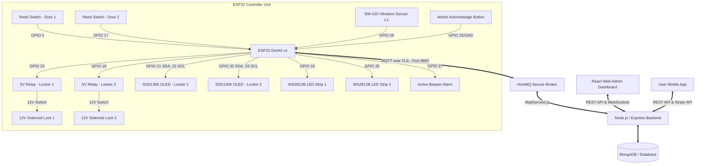
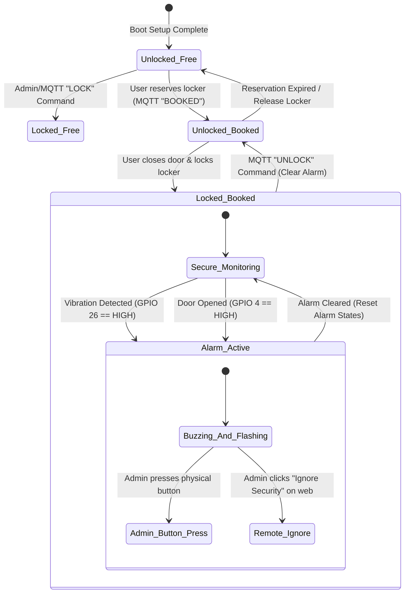

# LOX Smart Locker System
## 🛠️ End-to-End Hardware Design & Architecture Manual

This document provides a detailed overview of the hardware design, engineering principles, component selection, wiring configurations, and system integration for the **LOX Smart Locker System**. 

The LOX Smart Locker is an IoT-enabled, secure, and keyless public storage solution. It integrates an ESP32-based microcontroller, magnetic door sensors, solenoid locks controlled via relays, addressable WS2812B LEDs, local SSD1306 OLED displays, and security break-in detection (SW-420 vibration sensors) with a cloud-hosted secure MQTT broker and Node.js backend.

---

## 📌 1. System Architecture & Information Flow

The LOX system bridges the physical world (lockers, sensors, actuators) with cloud-hosted backend services and user interfaces. 



### End-to-End Event Pipeline
1. **User Reservation & Payment**: The customer books a locker on the **Mobile App** and pays securely using **Stripe**.
2. **Command Issue**: Upon successful payment, the backend database is updated, and the **Node.js Backend** publishes an `UNLOCK` command to the MQTT topic `locker/L1/control`.
3. **Execution**: The **ESP32** receives the message, verifies it, activates the **Relay (GPIO 23)** to pull back the **12V Solenoid Lock**, and triggers the **OLED** to display `UNLOCKED` and the **NeoPixels** to light up green (indicating availability).
4. **Sensor Verification**: When the user opens the door, the **Magnetic Reed Switch (GPIO 4)** breaks contact. The ESP32 immediately updates the OLED to show `Door: OPEN` and publishes `OPEN` on the topic `locker/L1/door`.
5. **Auto-Relock**: Once the user closes the door, the ESP32 senses the closed loop via the Reed Switch, publishes `CLOSED` to the MQTT broker, and automatically triggers the solenoid to **LOCK** itself again, securing the locker.
6. **Break-in Monitoring**: If the locker is locked, the **SW-420 Vibration Sensor** continually monitors structural vibration. If tampering is detected, the ESP32 sets off the local **Beeper** (pulsing alarm), flashes the **NeoPixels** in red and blue, writes a warning to the **OLED**, and publishes `VIBRATION_ALERT` to the backend. The backend updates the database and sends a **Push Notification** directly to the user's mobile app and the admin dashboard.

---

## 🎯 2. Hardware Design Principles

To ensure commercial-grade performance in public installations, the hardware design is built around four core principles:

### 1. Electrical Isolation & Reliability
*   **Optocoupler Isolation**: The ESP32 is a low-power microcontroller operating at 3.3V, while the solenoid locks require 12V and draw substantial surge current (up to 1.5A) during actuation. The system uses **isolated relay modules** to keep the sensitive logic circuit electrically separated from the high-current lock actuators, preventing electromagnetic interference (EMI) and power reset brownouts.
*   **Flyback Diode Protection**: Solenoid locks are inductive loads. When powered off, they produce a reverse voltage spike (back-EMF). Flyback diodes (e.g., 1N4007) are installed across the solenoid coils to clamp these spikes and prevent damage to the relay contacts and power supply rails.

### 2. Immediate, Multimodal User Feedback
*   **Visual Displays**: Real-time information is displayed on-site using dual local OLED screens. Users immediately know if the locker is locked, unlocked, booked, or out-of-order.
*   **Intuitive Color States**: Addressable WS2812B NeoPixel strips provide bright interior illumination and high-visibility status cues:
    *   🟢 **Green**: Locker is available / Unlocked.
    *   🔴 **Red**: Locker is reserved / Locked.
    *   🔵 **Blue**: Maintenance/System configuration mode.
    *   🚨 **Alternating Red/Blue**: Security Alert / Tamper Warning.
*   **Audible Notifications**: An active buzzer provides acoustic verification for locker operations (short beeps for confirmation) and loud pulsing tones for security alarms.

### 3. Comprehensive Physical & Tamper Security
*   **Double-Tiered Intrusion Detection**:
    1.  *State Discrepancy Monitoring*: If the door state reports `OPEN` while the locker state is set to `LOCKED`, the system flags a physical door breach.
    2.  *Structural Vibration Detection*: The SW-420 vibration sensor monitors impact or drilling forces on the locker frame. If a threshold is crossed while the locker is locked, the local alarm sounds.
*   **Alert Latching**: Once triggered, a security alert is latched. It cannot be cleared by power-cycling the device or tapping the sensor again. It requires an explicit administrative action (pressing the physical hidden button or sending an MQTT `IGNORE` payload from the dashboard).

### 4. Non-Blocking System Performance
*   **Asynchronous Software Architecture**: The firmware uses non-blocking delay patterns (`millis()` loops) to ensure that slow visual updates, LED animations, or network handshakes do not block real-time polling of critical door and vibration sensors.

---

## 🔌 3. Hardware Components Overview & Selection

| Component | Selected Hardware Model | Purpose / Choice Rationale | Operating Voltage | Current Draw |
|---|---|---|---|---|
| **Microcontroller** | **ESP32 DevKit v1** (30-pin) | Provides dual-core processing (core 0 handles WiFi/MQTT, core 1 handles logic/sensors), built-in Wi-Fi client, 15+ available GPIO pins, and support for hardware I2C buses. | 3.3V (Logic) / 5V (USB) | ~80mA - 240mA |
| **Local Displays** | **0.96" SSD1306 OLED** (x2) | Low power consumption, high contrast, readable in dim lighting. Communicates via I2C. A second display is mapped to a secondary software-based I2C bus on the ESP32 (`WireL2`) to bypass address collisions (both default to 0x3C). | 3.3V | ~15mA - 20mA |
| **Solenoid Locks** | **12V Solenoid Cabinet Lock** | Heavy-duty steel latch. Fail-secure (remains locked during power loss). Actuates instantly when power is applied. | 12V | ~800mA - 1200mA |
| **Actuators** | **5V Optocoupler Relay Module** | Bridges the ESP32's 3.3V logic to the 12V lock circuit. Optocoupler isolation protects the microcontroller from voltage transients. | 5V (coil) | ~70mA (active) |
| **Door Sensors** | **Magnetic Reed Switch** | Simple contact sensor. Closed when door is shut, open when a user pulls the door open. Unaffected by dust or outdoor debris. Configured with ESP32's internal pull-up resistor. | 3.3V (internal pull-up) | < 1mA |
| **Vibration Sensor** | **SW-420 Module** | Spring-based omnidirectional vibration sensor. Digital output goes HIGH upon vibration. Includes an onboard potentiometer to adjust sensitivity. | 3.3V - 5V | ~15mA |
| **Status Indicators** | **WS2812B NeoPixel RGB Strips** | Addressable LEDs that allow control of 14 separate pixels using a single GPIO line. Provides bright interior lighting and status-based color animation. | 5V | ~20mA - 60mA per LED |
| **Audio Alarm** | **5V Active Buzzer** | High-pitch oscillator module. Emits a loud, piercing tone when triggered without requiring PWM frequency generation from the ESP32 code. | 5V | ~30mA |
| **Local Override** | **Momentary Push Button** | Tactical tactile button mounted inside the secure admin compartment to physically clear alerts and reset alarm states. | 3.3V (internal pull-up) | < 1mA |

---

## 🗺️ 4. Visual Wiring Schematic & Pinout Configuration

### ESP32 Pin Connections Reference

```
                             ESP32 DevKit v1
                          ┌──────────────────┐
                          │                  │
         GND ─────────────┤ GND          3V3 ├─────→ OLED 1 VCC / OLED 2 VCC
         GND (Btn) ───────┤ GND           EN ├
                          │ D35          SVP ├
                          │ D34          SVN ├
                          │ D39          D32 ├─────→ OLED 2 SDA
                          │ D36          D33 ├─────→ OLED 2 SCL
      Door L2 (Reed) ─────┤ D4*          D25 ├─────→ NeoPixel Strip L2 Signal (5V Logic Shifted)
      Door L1 (Reed) ─────┤ D17*         D26 ├─────→ SW-420 Vibration Sensor DO
         (unused) ────────┤ D15          D27 ├─────→ Active Beeper Signal (VCC/GND separate)
         (unused) ────────┤ D8           D14 ├
         (unused) ────────┤ D7           D12 ├
      Admin Btn (L1) ─────┤ D6 (Btn Pin) GND ├
         (unused) ────────┤ D11          D13 ├
         (unused) ────────┤ D5           D9  ├
         (unused) ────────┤ D3           D10 ├
       Relay L1 Control ──┤ D23          D23 ├─────→ Relay L1 Signal (IN pin)
       OLED 1 SCL ────────┤ D22 (SCL)    D19 ├─────→ NeoPixel Strip L1 Signal
       OLED 1 SDA ────────┤ D21 (SDA)    GND ├─────→ Common Power Ground
      Relay L2 Control ──┤ D18          D18 ├
                          │                  │
                          └──────────────────┘
```

### Complete Wiring Pin Table

| Component | Component Pin | ESP32 Pin | Signal Type | Notes |
|---|---|---|---|---|
| **Locker 1 Solenoid Relay** | IN | **GPIO 23** | Digital Output | HIGH = Unlock (Active solenoid), LOW = Locked |
| **Locker 2 Solenoid Relay** | IN | **GPIO 18** | Digital Output | HIGH = Unlock, LOW = Locked |
| **L1 Door Sensor (Reed)** | Sig | **GPIO 4** | Digital Input | INPUT_PULLUP. HIGH = Door Open, LOW = Door Closed |
| **L2 Door Sensor (Reed)** | Sig | **GPIO 17** | Digital Input | INPUT_PULLUP. HIGH = Door Open, LOW = Door Closed |
| **L1 OLED Display (SSD1306)** | SDA / SCL | **GPIO 21 / 22** | I2C Bus 0 | Default hardware I2C bus. Connected to 3.3V |
| **L2 OLED Display (SSD1306)** | SDA / SCL | **GPIO 32 / 33** | I2C Bus 1 | Mapped to software-defined `WireL2` I2C bus |
| **L1 NeoPixel LED Strip** | DI | **GPIO 19** | Digital Output | Drives 14 addressable RGB LEDs (Requires 5V power) |
| **L2 NeoPixel LED Strip** | DI | **GPIO 25** | Digital Output | Drives 14 addressable RGB LEDs (Requires 5V power) |
| **SW-420 Vibration Sensor** | DO | **GPIO 26** | Digital Input | HIGH = Vibration detected, LOW = Quiet |
| **Active Alarm Buzzer** | I/O | **GPIO 27** | Digital Output | Active LOW configuration. LOW = Beeping alarm |
| **Door Indicator LED** | Anode | **GPIO 16** | Digital Output | Auxiliary physical indicator LED for Locker 1 |
| **Admin Ignore Button** | Pin 1 / 2 | **GPIO 25 / GND** | Digital Input | INPUT_PULLUP. LOW = Button Pressed (Acknowledge) |

---

## 📡 5. Software-Hardware Integration & MQTT Telemetry

The ESP32 communicates with the backend via HiveMQ using specific topics and structured payloads. All data values are published as retained messages when status updates occur.

### MQTT Topic Space

```
locker/
 ├── L1/
 │    ├── control      <-- Subscribe: [LOCK, UNLOCK]
 │    ├── state        <-- Publish: [LOCKED, UNLOCKED]
 │    ├── door         <-- Publish: [OPEN, CLOSED]
 │    ├── booking      <-- Subscribe: [BOOKED, FREE]
 │    ├── security     <-- Pub/Sub: [ALERT, VIBRATION_ALERT, IGNORE]
 │    └── maintenance  <-- Subscribe: [MAINTENANCE_ON, MAINTENANCE_OFF]
 └── L2/
      ├── control
      ├── state
      ├── door
      ├── booking
      ├── security
      └── maintenance
```

### Telemetry Payload Specification

1. **Locker Command (`control`)**
   *   **Direction**: Inbound to ESP32
   *   **Payload**: `"LOCK"` / `"UNLOCK"`
   *   **Action**: Reassesses relay pins, disengages or engages the solenoid latch, and clears temporary alarm conditions.

2. **Locker State (`state`)**
   *   **Direction**: Outbound from ESP32
   *   **Payload**: `"LOCKED"` / `"UNLOCKED"`
   *   **Action**: Backend updates database records, rendering the real-time locker widget state on the user app.

3. **Door State (`door`)**
   *   **Direction**: Outbound from ESP32
   *   **Payload**: `"OPEN"` / `"CLOSED"`
   *   **Action**: Triggered by magnetic switch interrupt. Auto-relocks locker when state returns to `CLOSED`.

4. **Booking Status (`booking`)**
   *   **Direction**: Inbound to ESP32
   *   **Payload**: `"BOOKED"` / `"FREE"`
   *   **Action**: ESP32 updates local OLED display readout and switches NeoPixel colors (Green vs. Red).

5. **Security Channel (`security`)**
   *   **Direction**: Bi-directional
   *   **Outbound Payloads**:
       *   `"VIBRATION_ALERT"`: SW-420 sensor digital output registered HIGH while locker was locked.
       *   `"ALERT"`: Reed switch registered OPEN while locker state was set to LOCKED.
   *   **Inbound Payloads**:
       *   `"IGNORE"`: Sent from admin panel. Clears alarms, silences buzzer, and resets NeoPixels.

---

## 🔒 6. Security State Machine Logic

The security logic built into the ESP32 firmware behaves as a state machine that transitions based on hardware inputs (sensors) and remote control commands:



---

## 🛠️ 7. Installation, Mounting, & Calibration

### 1. Mounting the SW-420 Vibration Sensor
*   **Location**: Mount the module on the interior metal frame of the locker, as close as possible to the solenoid latch mechanism. Impacts or forced entry attempts will transfer mechanical waves most clearly to this structural point.
*   **Isolation**: Ensure the sensor module is screwed tightly or taped with high-density mounting tape. A loose sensor module will float and register false negatives or constant vibrations (flickering).

### 2. Tuning the Sensitivity Potentiometer
The SW-420 board features a small blue potentiometer dial:
1.  **Clockwise Rotation**: Increases sensitivity (requires *less* force to trigger).
2.  **Counter-Clockwise Rotation**: Decreases sensitivity (requires *more* force to trigger).
3.  **Tuning Protocol**:
    *   Set the dial to the center-point (12 o'clock).
    *   Close and lock the locker door.
    *   Gently tap the locker door with your knuckles (simulating normal environment). The red indicator LED on the sensor should **not** light up.
    *   Slam or shake the locker violently (simulating a break-in). The red sensor LED should turn **on**.
    *   Adjust the dial by 5-degree increments until this threshold is reached.

### 3. Addressing Dual-OLED I2C Address Collisions
*   Since both 0.96" SSD1306 display panels default to I2C address `0x3C`, connecting both to the default ESP32 pins (GPIO 21 & 22) simultaneously is not possible.
*   **Solution**: Initialize a secondary hardware I2C interface on ESP32 (`WireL2`) using pins **GPIO 32 (SDA)** and **GPIO 33 (SCL)**.
*   **Firmware configuration**:
    ```cpp
    TwoWire WireL2 = TwoWire(1); // Instantiate secondary I2C port
    Adafruit_SSD1306 displayL2(SCREEN_WIDTH, SCREEN_HEIGHT, &WireL2, -1);
    
    // In setup()
    Wire.begin(21, 22);       // Default I2C bus for L1 OLED
    display.begin(SSD1306_SWITCHCAPVCC, 0x3C);
    
    WireL2.begin(32, 33);     // Secondary I2C bus for L2 OLED
    displayL2.begin(SSD1306_SWITCHCAPVCC, 0x3C);
    ```

---

## 🔍 8. Troubleshooting Guide

| Problem | Possible Cause | Verification Step | Corrective Action |
|---|---|---|---|
| **OLED display is blank on startup** | I2C wire failure or address collision. | Check if display prints initialization text in serial logs. Run an I2C scanner script to verify the address. | Re-connect SDA and SCL jumper cables. Check if VCC is connected to the 3.3V pin (not 5V). |
| **Solenoid lock hums but does not open** | Insufficient current or voltage drop. | Measure output voltage across relay terminals during actuation. | Ensure the solenoid is powered by a dedicated 12V 2A external DC power adapter. |
| **Locker triggers false vibration alerts** | Sensitivity is too high, or mounting is loose. | Tap the frame gently. Check if the onboard sensor LED turns red. | Turn the SW-420 potentiometer counter-clockwise. Ensure the sensor is securely glued or screwed down. |
| **Door status is stuck on OPEN or CLOSED** | Magnetic reed switch misaligned. | Bring a strong magnet near the reed switch. Observe if logic changes. | Adjust the physical placement of the door magnet. Ensure the gap is less than 10mm when the door is shut. |
| **Beeper does not sound during alarm** | Polarized active buzzer wired backwards, or incorrect logic. | Check if `beeperActiveLow` is configured correctly in the firmware. | Reverse the buzzer signal/ground wires. Active buzzers require correct VCC/GND polarity to sound. |
| **ESP32 resets repeatedly when lock triggers** | Solenoid back-EMF spike feeding back into ESP32 board. | Check if reset occurs exactly at the moment the lock is triggered. | Install a 1N4007 flyback diode in parallel with the solenoid coil pins (cathode to positive side). |
